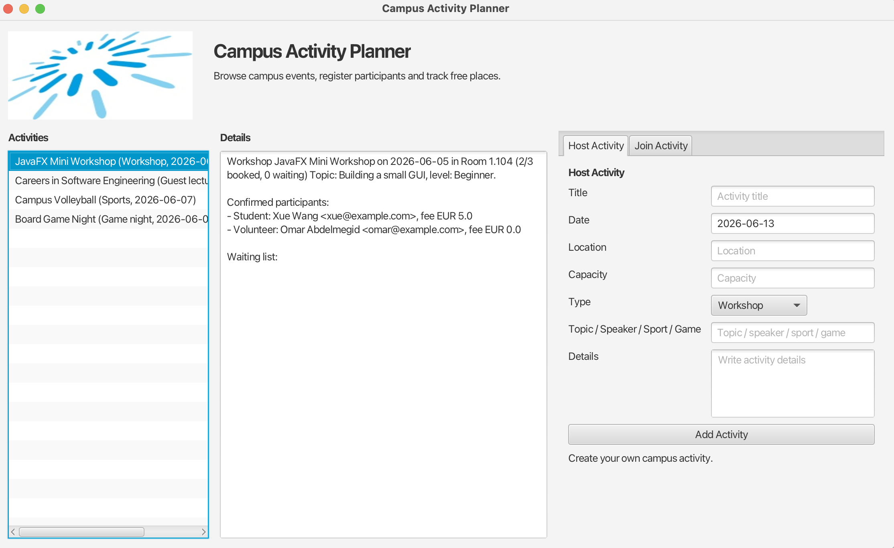

# Campus Activity Planner

JavaFX desktop application for browsing campus activities and managing registrations.

Object-Oriented Concepts - Summer Semester 2026

Yousuf Sidiqi - Omar Abdelmegid - Xue Wang

---

# Presentation Structure

| Presenter | Main focus | Rubric points covered |
| --- | --- | --- |
| Yousuf Sidiqi | Application, GUI and class model | what the app does, JavaFX GUI image, UML, classes created |
| Omar Abdelmegid | OOP design and data structures | inheritance, polymorphism, collections, HashMap, HashSet, Comparator, lambdas, streams |
| Xue Wang | Identity, tests and reflection | equals/hashCode, JUnit test, debugged error, future improvements |

This order follows the assessment requirements directly, so each required topic has a clear place.

---
layout: center
class: text-center
---

# Yousuf Sidiqi

Application, JavaFX GUI, UML and created classes

---
layout: two-cols
---

# What the Application Does

- Shows campus activities such as workshops, guest lectures, sports and game nights
- Lets students register for an activity
- Tracks confirmed registrations, free places and waiting list entries
- Prevents duplicate participants for the same activity
- Supports different registration types with different fees and priorities

::right::


---

# JavaFX GUI



<div class="text-sm mt-2">
Header image, sorted activity list, activity details, waiting list, hosting tab and joining tab.
</div>

---

# UML Class Diagram


---
layout: two-cols
class: text-sm
---

# Classes We Created and Why

| Class | Why we created it |
| --- | --- |
| `CampusActivity` | Shared activity data and behavior |
| `Workshop`, `GuestLecture` | Specific activity types |
| `SportsActivity`, `GameNight` | More concrete activity types |
| `Participant` | Person data and identity logic |

::right::

| Class | Why we created it |
| --- | --- |
| `Registration` | Connects participant to activity |
| `StudentRegistration` | Student fee behavior |
| `StandardRegistration` | Default registration behavior |
| `VolunteerRegistration` | Free fee and higher priority |
| `SpeakerRegistration` | Speaker-specific registration |
| `CampusActivityPlanner` | Collections, search and sorting |
| `CampusActivityGUI` | JavaFX user interface |

Main reason: keep activity data, participant identity, registration behavior
and GUI code separate.

---
layout: center
class: text-center
---

# Omar Abdelmegid

Inheritance, polymorphism, collections and Java features

---

# Inheritance

Two inheritance hierarchies are used.


Why:
- Activity subclasses share id, title, date, location, capacity and registration behavior
- Registration subclasses share participant and timestamp, but customize fee and priority

---

# Polymorphism: Activity Types

`CampusActivity` references can call subclass behavior.

```java
public abstract class CampusActivity {
    public abstract String getActivityType();
    public String describe() { ... }
}

public class Workshop extends CampusActivity {
    @Override
    public String getActivityType() {
        return "Workshop";
    }

    @Override
    public String describe() {
        return super.describe() + " Topic: " + topic;
    }
}
```

`getDisplayLines()` stores activities as `CampusActivity`, but each object
uses its own `describe()` implementation.

---

# Polymorphism: Registration Types

The GUI creates different subclasses, but the rest of the app receives
one common type: `Registration`.

```java
private Registration createRegistration(Participant participant) {
    if ("Volunteer".equals(type)) {
        return new VolunteerRegistration(participant);
    }
    if ("Speaker".equals(type)) {
        return new SpeakerRegistration(participant);
    }
    return new StudentRegistration(participant);
}
```

After this point, `CampusActivity` does not need to know the exact subclass.
Overridden fee and priority behavior still comes from the concrete registration type.

---

# Composition

The design also uses HAS-A relationships.

- A campus activity has many registrations
- A campus activity has one confirmed registration list
- A campus activity has one waiting list
- A registration has one participant
- This keeps activity logic separate from participant identity data

---

# Collections

`CampusActivityPlanner` uses multiple collections because each one has a different job.

| Collection | Used for | Why |
| --- | --- | --- |
| `ArrayList<CampusActivity>` | Main activity list | Keeps insertion order and is easy to display |
| `HashMap<String, CampusActivity>` | Activity lookup by id | Fast access with `findById()` |
| `HashSet<Participant>` | Unique participants | Prevents duplicate participant objects |
| `TreeSet<CampusActivity>` | Activities sorted by date | Uses `Comparable` automatically |

---

# HashMap and HashSet

These two collections have different jobs.

- `HashMap` gives fast activity lookup by activity id
- `HashSet` prevents duplicate participants using `equals()` and `hashCode()`
- `TreeSet` keeps activities ordered by date through `Comparable`

---

# Comparator, Lambdas and Streams

```java
return activities.stream()
    .sorted(Comparator.comparingInt(CampusActivity::getCapacity)
        .thenComparing(CampusActivity::getTitle))
    .collect(Collectors.toList());

return activities.stream()
    .filter(CampusActivity::hasFreePlaces)
    .collect(Collectors.toList());

return activities.stream()
    .map(activity -> activity.getId() + " | " + activity.describe())
    .collect(Collectors.toList());
```

- `Comparator` sorts activities by capacity, then title
- Lambda expressions make the sorting and mapping logic short
- Streams are used for searching, filtering and display text

---
layout: center
class: text-center
---

# Xue Wang

equals/hashCode, JUnit test, debugged error and improvements

---

# equals(): Participant Identity

`Participant` uses one identity rule: the matriculation number.
E-mail is still stored, but it is not the unique identifier.

```java {all|1-6|8-10}
public void setEmail(String email) {
    if (email == null || !email.contains("@")) {
        throw new IllegalArgumentException("E-mail must contain @.");
    }
    this.email = email.trim();
}

public void setMatriculationNumber(String value) {
    this.matriculationNumber = value == null ? "" : value.trim();
}
```

That means e-mail case does not decide whether two participants are equal.
Same e-mail with different matriculation numbers is allowed.

---

# equals(): Same Matriculation Number

`equals()` compares the matriculation number, not the e-mail address.

```java {all|1-9}
@Override
public boolean equals(Object other) {
    if (this == other) return true;
    if (!(other instanceof Participant)) return false;
    Participant that = (Participant) other;
    return !matriculationNumber.isEmpty()
        && Objects.equals(matriculationNumber,
                          that.matriculationNumber);
}
```

This is used when the app checks for duplicate participants in an activity.

Example: `shared@example.com / 10001` and `shared@example.com / 10002`
are two different participants.

---

# hashCode(): Same Rule for HashSet

`HashSet<Participant>` uses `hashCode()` first, then `equals()`.
Both methods must use the same identity field.

```java {all|1-6}
@Override
public int hashCode() {
    return matriculationNumber.isEmpty()
        ? System.identityHashCode(this)
        : Objects.hash(matriculationNumber);
}
```

```java {all|1|3}
private final HashSet<Participant> participants;

participants.add(registration.getParticipant());
```

If two participants have the same matriculation number, they produce the same
hash input and compare equal.

---

# JUnit Test: Fill Activity

This test shows the full waiting-list flow.
The workshop capacity is `1`, so the first registration fills the activity.

```java {all|1-7|1,9-10|1,12-14|1,16-19}
@Test
void fullActivityUsesWaitingListAndPromotesAfterCancel() {
    CampusActivityPlanner planner = new CampusActivityPlanner();
    Workshop workshop = new Workshop("T01", "Test Workshop",
        java.time.LocalDate.of(2026, 6, 1),
        "Lab", 1, "Testing", "Beginner");
    planner.addActivity(workshop);

    Participant first = new Participant("First Student", "first@example.com", "10001");
    Participant second = new Participant("Second Student", "second@example.com", "10002");

    assertTrue(planner.register("T01",
        new StudentRegistration(first)));
    assertEquals(0, workshop.getFreePlaces());

    assertTrue(planner.register("T01",
        new VolunteerRegistration(second)));
    assertEquals(1, workshop.getRegistrations().size());
    assertEquals(1, workshop.getWaitingList().size());
}
```

The second registration is accepted, but goes to the waiting list.

---

# JUnit Test: Promote Waiting List

When the first participant cancels, the waiting-list entry moves into confirmed registrations.

```java {all|1|2|3}
assertTrue(planner.cancel("T01", first));
assertEquals(second, workshop.getRegistrations().get(0).getParticipant());
assertEquals(0, workshop.getWaitingList().size());
```

Full behavior verified:

- first registration fills the activity
- second registration enters the waiting list
- cancellation promotes the waiting-list participant

---

# Error Found and Debugged

Problem found while testing participant identity:

- Old logic treated e-mail as the participant identity
- Same e-mail with different matriculation numbers was too easy to reject
- E-mail is contact data, not the stable student identifier
- Matriculation number should decide duplicate registration
- `equals()` and `hashCode()` must use that same rule

Fix:

```java
return !matriculationNumber.isEmpty()
    && Objects.equals(matriculationNumber,
                      that.matriculationNumber);
```

```java
return matriculationNumber.isEmpty()
    ? System.identityHashCode(this)
    : Objects.hash(matriculationNumber);
```

Result: `HashSet` and duplicate registration checks now use the same identity rule.

---

# Demo Flow

1. Start `CampusActivityGUI`
2. Select `JavaFX Mini Workshop`
3. Show the campus image in the header
4. Register a participant with a name, email and registration type
5. Fill a small-capacity activity to show the waiting list
6. Use `Show free places` to demonstrate stream filtering
7. Try registering the same matriculation number twice to show duplicate prevention

---

# What We Would Improve

- Save activities and registrations to a file or database
- Add stronger input validation for email and dates
- Add editing and deleting activities in the GUI
- Add search/filter controls directly in the GUI
- Add more tests for invalid inputs and registration priorities
- Improve the GUI layout and styling for smaller screens

---
layout: end
---

# Thank You

Questions?
