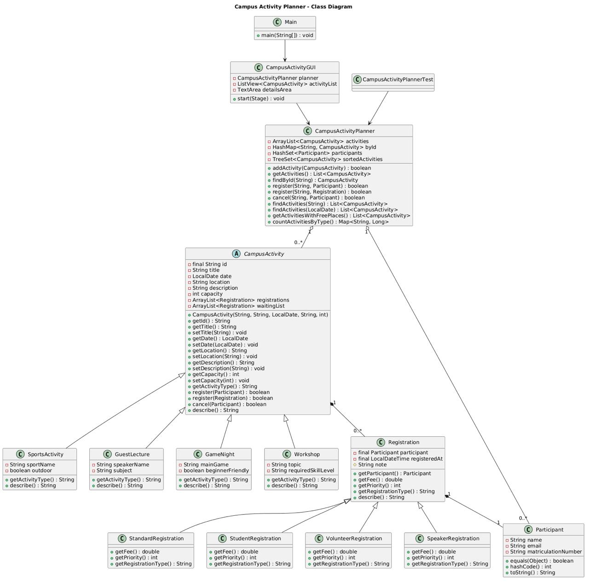
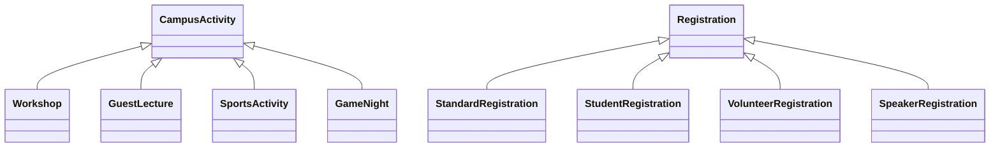

# Campus Activity Planner

JavaFX desktop application for browsing campus activities and managing registrations.

Object-Oriented Concepts - Summer Semester 2026

Omar Abdelmegid - Xue Wang - Yousuf Sidiqi

---
layout: two-cols
---

# What the Application Does

- Shows campus activities such as workshops, guest lectures, sports and game nights
- Lets students register for an activity
- Tracks confirmed registrations, free places and waiting list entries
- Prevents duplicate participants for the same activity
- Supports different registration types with different fees and priorities

::right::


---

# JavaFX GUI

The GUI is implemented in `CampusActivityGUI`.

- Header includes the required image
- Left side: sorted activity list
- Center: details, confirmed participants and waiting list
- Right side: tabs for hosting and joining activities
- Buttons: `Add Activity`, `Register`, `Show free places`, `Show all`

```java {all|5-8|10-13}
ImageView poster = new ImageView(loadCampusImage());
poster.setFitWidth(230);
poster.setFitHeight(110);

Button registerButton = new Button("Register");
registerButton.setOnAction(event ->
        registerSelectedParticipant());

Button freeOnlyButton = new Button("Show free places");
freeOnlyButton.setOnAction(event -> activityList.setItems(
        FXCollections.observableArrayList(
                planner.getActivitiesWithFreePlaces())));
```

---

# UML Class Diagram



---

# Classes We Created and Why

| Class | Purpose |
| --- | --- |
| `CampusActivity` | Abstract base class for shared activity data and behavior |
| `Workshop`, `GuestLecture`, `SportsActivity`, `GameNight` | Concrete activity types with specific fields |
| `Participant` | Stores person data and duplicate identity logic |
| `Registration` | Connects a participant to an activity |
| `Student`, `Standard`, `Volunteer`, `SpeakerRegistration` | Different fees and waiting-list priorities |
| `CampusActivityPlanner` | Manager/controller for collections, search, sorting and demo data |
| `CampusActivityGUI` | JavaFX user interface |

---

# Inheritance

Two inheritance hierarchies are used.



Why:
- Activity subclasses share id, title, date, location, capacity and registration behavior
- Registration subclasses share participant and timestamp, but customize fee and priority

---

# Polymorphism: Activity Types

`CampusActivity` references can call subclass behavior.

```java {all|1-4|6-13}
public abstract class CampusActivity {
    public abstract String getActivityType();
    public String describe() { ... }
}

public class Workshop extends CampusActivity {
    @Override
    public String getActivityType() {
        return "Workshop";
    }

    @Override
    public String describe() {
        return super.describe() + " Topic: " + topic;
    }
}
```

`getDisplayLines()` stores activities as `CampusActivity`, but each object
uses its own `describe()` implementation.

---

# Polymorphism: Registration Types

The GUI creates different subclasses, but the rest of the app receives
one common type: `Registration`.

```java {all|1|3|6|9}
private Registration createRegistration(Participant participant) {
    if ("Volunteer".equals(type)) {
        return new VolunteerRegistration(participant);
    }
    if ("Speaker".equals(type)) {
        return new SpeakerRegistration(participant);
    }
    return new StudentRegistration(participant);
}
```

After this point, `CampusActivity` does not need to know the exact subclass.

---

# Polymorphism: Dynamic Dispatch

`Registration.describe()` calls methods that subclasses override.

```java {all|1-4|6-9}
public String describe() {
    return getRegistrationType()
        + ": " + participant
        + ", fee EUR " + getFee();
}

public double getFee() { return 10.0; }       // base
// StudentRegistration: 5.0
// Volunteer/Speaker: 0.0
```

The same happens when the waiting list is sorted:

```java {all|1|3-5}
waitingList.sort((first, second) ->
    Integer.compare(
        second.getPriority(),
        first.getPriority()));
```

---

# Composition

The design also uses HAS-A relationships.

```java
public abstract class CampusActivity {
    private final ArrayList<Registration> registrations;
    private final ArrayList<Registration> waitingList;
}

public class Registration {
    private final Participant participant;
}
```

Why:
- A campus activity has many registrations
- A registration has one participant
- This keeps activity logic separate from participant identity data

---

# Collections

`CampusActivityPlanner` uses multiple collections because each one has a different job.

| Collection | Used for | Why |
| --- | --- | --- |
| `ArrayList<CampusActivity>` | Main activity list | Keeps insertion order and is easy to display |
| `HashMap<String, CampusActivity>` | Activity lookup by id | Fast access with `findById()` |
| `HashSet<Participant>` | Unique participants | Prevents duplicate participant objects |
| `TreeSet<CampusActivity>` | Activities sorted by date | Uses `Comparable` automatically |

---

# HashMap, HashSet, Comparator

```java {all|1-4|6-9|11-15}
private final HashMap<String, CampusActivity> activityMap;
private final HashSet<Participant> participants;
private final TreeSet<CampusActivity> sortedActivities;

public CampusActivity findById(String id) {
    return activityMap.get(id.trim());
}

participants.add(registration.getParticipant());

return activities.stream()
    .sorted(Comparator.comparingInt(CampusActivity::getCapacity)
        .thenComparing(CampusActivity::getTitle))
    .collect(Collectors.toList());
```

The `Comparator` sorts by capacity first and title second.

---

# Lambdas and Streams

Streams are used for searching, filtering, grouping and mapping.

```java {all|1-5|7-10|12-15}
public List<CampusActivity> getActivitiesWithFreePlaces() {
    return activities.stream()
        .filter(CampusActivity::hasFreePlaces)
        .collect(Collectors.toList());
}

public Map<String, Long> countActivitiesByType() {
    return activities.stream()
        .collect(Collectors.groupingBy(
            CampusActivity::getActivityType, Collectors.counting()));
}

public List<String> getDisplayLines() {
    return activities.stream()
        .map(activity -> activity.getId() + " | " + activity.describe())
        .collect(Collectors.toList());
}
```

---

# equals(): Participant Identity

`Participant` uses one identity rule: the normalized e-mail address.

```java {all|2-5|8}
public void setEmail(String email) {
    if (email == null || !email.contains("@")) {
        throw new IllegalArgumentException("E-mail must contain @.");
    }
    this.email = normalizeEmail(email);
}

private String normalizeEmail(String value) {
    return value.trim().toLowerCase();
}
```

That means `XUE@example.com` and `xue@example.com` become the same identity.

---

# equals(): Same Email, Same Person

`equals()` compares only the normalized e-mail field.

```java {all|2|7}
@Override
public boolean equals(Object other) {
    if (this == other) return true;
    if (!(other instanceof Participant)) return false;
    Participant that = (Participant) other;
    return Objects.equals(email, that.email);
}
```

This is used when the app checks for duplicate participants in an activity.

---

# hashCode(): Same Rule for HashSet

`HashSet<Participant>` uses `hashCode()` first, then `equals()`.
Both methods must use the same identity field.

```java {all|3}
@Override
public int hashCode() {
    return Objects.hash(email);
}
```

```java {all|1|3}
private final HashSet<Participant> participants;

participants.add(registration.getParticipant());
```

If two participants have the same normalized e-mail, they produce the same
hash input and compare equal.

---

# JUnit Test

`CampusActivityPlannerTest` covers three important behaviors.

```java {all|1-8|10-14}
@Test
void fullActivityUsesWaitingListAndPromotesAfterCancel() {
    assertTrue(planner.register("T01",
        new StudentRegistration(first)));
    assertTrue(planner.register("T01",
        new VolunteerRegistration(second)));
    assertEquals(1, workshop.getWaitingList().size());
}

@Test
void duplicateParticipantCannotRegisterTwiceForSameActivity() {
    Participant duplicate = new Participant("Xue Wang", "XUE@example.com");
    assertFalse(planner.register("W01", duplicate));
}
```

Also tested:
- waiting-list promotion after cancellation
- overloaded `findActivities(String)` and `findActivities(LocalDate)`

---

# Error Found and Debugged

Problem found while checking duplicate participant behavior:

- Project docs mentioned e-mail / matriculation number
- Test creates `xue@example.com` and `XUE@example.com`
- Email is normalized to lowercase
- Equality must use one stable identity rule
- `hashCode()` must match the same field as `equals()`

Fix:

```java
return Objects.equals(email, that.email);
```

```java
return Objects.hash(email);
```

Result: `HashSet` and duplicate registration checks now use the same identity rule.

---

# Demo Flow

1. Start `CampusActivityGUI`
2. Select `JavaFX Mini Workshop`
3. Show the campus image in the header
4. Register a participant with a name, email and registration type
5. Fill a small-capacity activity to show the waiting list
6. Use `Show free places` to demonstrate stream filtering
7. Try registering the same email twice to show duplicate prevention

---

# What We Would Improve

- Save activities and registrations to a file or database
- Add stronger input validation for email and dates
- Add editing and deleting activities in the GUI
- Add search/filter controls directly in the GUI
- Add more tests for invalid inputs and registration priorities
- Improve the GUI layout and styling for smaller screens

---
layout: end
---

# Thank You

Questions?
